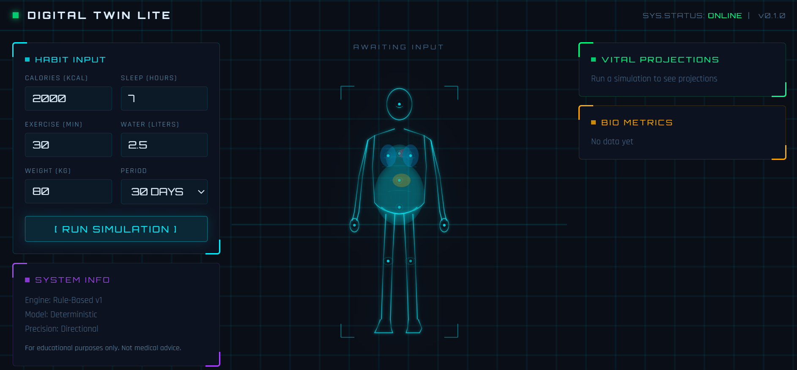

<p align="center">
  <h1 align="center">Digital Twin Lite</h1>
  <p align="center"><strong>See the outcome of your habits before you live them.</strong></p>
  <p align="center">
    <a href="#quick-start">Quick Start</a> &nbsp;&bull;&nbsp;
    <a href="#how-it-works">How It Works</a> &nbsp;&bull;&nbsp;
    <a href="#architecture">Architecture</a> &nbsp;&bull;&nbsp;
    <a href="#api">API</a> &nbsp;&bull;&nbsp;
    <a href="#roadmap">Roadmap</a>
  </p>
</p>

<p align="center">
  
  
  
  
</p>

<p align="center">
  
</p>

---

## The Problem

Most health apps track the past. They tell you what you ate, how you slept, what you did yesterday.

**Digital Twin Lite does the opposite.** It takes your current habits and simulates what happens next — projecting your weight and energy trajectory over 7, 30, or 90 days through a holographic body visualization that changes in real time.

This shifts the user from passive tracking to active decision-making: *"If I keep doing this, where do I end up?"*

---

## What Makes This Different

| Traditional Trackers | Digital Twin Lite |
|---------------------|-------------------|
| Record the past | Simulate the future |
| Static dashboards | Morphing body visualization |
| Numbers in a table | Holographic HUD interface |
| "You ate 2000 kcal" | "At this rate, you'll weigh X in 30 days" |
| Passive logging | Active what-if exploration |

---

## Features

### Holographic Body Visualization
A wireframe human body rendered in SVG that physically morphs based on your projected outcomes. Gain weight and the body widens. Lose weight and it narrows. The glow color shifts with your energy score — green when you're thriving, red when habits are unsustainable. Internal organs are visible through the wireframe. Animated scan lines sweep across the figure. Pulsing data nodes mark key measurement points.

### Time Slider
A vertical "NOW to Future" slider inspired by digital twin research interfaces. Click or drag to any point in your simulation period and watch the body and every data panel update instantly to show your projected state on that day.

### HUD Dashboard
A sci-fi command center interface with neon cyan and green accents on a dark background. Glowing corner-traced panels display vital projections, bio metric progress bars, sparkline trend charts, and a simulation summary. Every element uses the Orbitron monospace typeface for a cohesive holographic aesthetic.

### Explainable Simulation Engine
Every prediction is deterministic and traceable. No black-box ML. The engine uses established nutritional principles — caloric balance drives weight change, sleep quality drives recovery, hydration supports performance, and consistent habits compound over time. You can explain every number on screen.

---

## Demo Scenario

> A user enters their daily habits and runs a 30-day projection:

**Input:**

| Habit | Value |
|-------|-------|
| Calories | 1,800 kcal/day |
| Sleep | 8 hours/night |
| Exercise | 45 min/day |
| Water | 3 liters/day |
| Current Weight | 85 kg |

**Output:**

| Metric | Result |
|--------|--------|
| Projected Weight (Day 30) | 82.4 kg |
| Weight Change | -2.6 kg |
| Average Energy Score | 79/100 |

**Insight:** Caloric deficit detected with strong recovery signals. Consistent sleep and hydration support sustained energy throughout the projection period. Steady, sustainable fat loss expected without energy crashes.

---

## How It Works

```
User Habits ──> Simulation Engine ──> Prediction Results ──> HUD Visualization
     │                  │                      │                     │
  calories          metabolic              day-by-day            morphing
  sleep             balance               weight trend          body SVG
  exercise          recovery              energy score         glow + scale
  water             modeling              trend summary        time scrubbing
```

### Simulation Systems

**Metabolic Balance** — The engine calculates net daily energy balance by comparing caloric intake against baseline metabolic expenditure and exercise burn. Surplus calories accumulate as weight gain; deficits produce weight loss, modeled at the established 7,700 kcal per kilogram ratio.

**Recovery & Sleep** — Sleep is the primary driver of the energy score. Optimal sleep (7-9 hours) generates significant energy gains. Below 6 hours, energy degrades noticeably. The system rewards consistency — sustained healthy sleep compounds benefits over time.

**Hydration** — Water intake above 2 liters per day boosts energy output. Below that threshold, a hydration penalty is applied, reflecting reduced physical and cognitive performance.

**Activity** — Exercise contributes to both caloric expenditure (affecting weight) and energy score (moderate activity boosts overall vitality up to a performance ceiling).

**Consistency Compounding** — Good habits build on themselves. The engine applies a small daily consistency bonus that accumulates over the simulation period, reflecting the real-world compounding effect of sustained healthy routines.

---

## Architecture

| Layer | Technology | Role |
|-------|-----------|------|
| Frontend | React + Recharts + Vite | HUD dashboard, body visualization, charts |
| Backend | Python + FastAPI | REST API, validation, orchestration |
| Database | SQLite + SQLAlchemy | Input storage, simulation history |
| Engine | Python (rule-based) | Deterministic prediction logic |

```
React UI  ←→  FastAPI  ←→  Simulation Engine
                 ↕
              SQLite DB
```

The system is fully modular. The simulation engine has zero dependencies on the web framework. The frontend communicates through a clean REST API. The database layer can be swapped from SQLite to PostgreSQL without touching the engine or UI.

---

<a id="api"></a>

## API

| Method | Endpoint | Description |
|--------|----------|-------------|
| `POST` | `/api/input` | Submit daily habit data (calories, sleep, exercise, water, weight) |
| `POST` | `/api/simulate` | Run a projection for 7, 30, or 90 days against a saved input |
| `GET` | `/api/results/{id}` | Retrieve full simulation results with day-by-day predictions and summary |

All responses include structured JSON with prediction arrays and computed summaries (final weight, average energy, net weight change).

Full request/response schemas are documented in [`docs/API_SPEC.md`](docs/API_SPEC.md).

---

<a id="quick-start"></a>

## Quick Start

### Prerequisites

- Python 3.10+
- Node.js 18+

### Setup

```bash
# Clone and enter the project
git clone <repo-url>
cd digital-twin-lite

# Backend
cd backend
pip install -r requirements.txt

# Frontend
cd frontend
npm install
```

Or use the setup scripts:

```bash
# Linux / macOS / Git Bash
./setup.sh

# Windows PowerShell
.\setup.ps1
```

### Run

```bash
# Terminal 1 — Backend
cd backend
python -m uvicorn app.main:app --reload

# Terminal 2 — Frontend
cd frontend
npm run dev
```

Open **http://localhost:5173** and run your first simulation.

### Production Scripts

Use the new root-level scripts for a build-and-run flow that matches deployment more closely:

```bash
# Linux / macOS / Git Bash
./build.sh
./run.sh

# Windows PowerShell
.\build.ps1
.\run.ps1
```

`build.sh` and `build.ps1` install frontend dependencies, create the production frontend bundle, and run the backend test suite.

`run.sh` and `run.ps1` start FastAPI in single-service mode so the built frontend and API are both served from **http://localhost:8000**.

If PowerShell blocks local scripts on Windows, run them with:

```powershell
powershell -ExecutionPolicy Bypass -File .\build.ps1
powershell -ExecutionPolicy Bypass -File .\run.ps1
```

If your machine uses a custom Python path, set `PYTHON_CMD` before running the scripts.

Keep the `uvicorn --reload` plus `npm run dev` workflow above for day-to-day local development.

### Environment Configuration

For local or hosted deployments, copy the example env files and adjust values as needed:

```bash
# Backend
cp backend/.env.example backend/.env

# Frontend
cp frontend/.env.example frontend/.env
```

Backend variables:

- `DATABASE_URL` - defaults to local SQLite; set this to PostgreSQL or another managed database when deploying
- `ALLOWED_ORIGINS` - comma-separated frontend origins allowed to call the API

Frontend variables:

- `VITE_API_BASE_URL` - API base URL used by the browser; keep `/api` when frontend and backend share one host
- `VITE_DEV_API_PROXY_TARGET` - local dev proxy target for Vite

### Deploy Online

This repo includes a production `Dockerfile` for single-service deployment. The container builds the React frontend, copies the built assets into the runtime image, and serves both the UI and API from FastAPI on one domain.

```bash
docker build -t digital-twin-lite .
docker run -p 8000:8000 -e PORT=8000 digital-twin-lite
```

Then open **http://localhost:8000**.

Recommended production setup:

- Set `DATABASE_URL` to a managed production database if you need durable multi-instance storage
- Set `ALLOWED_ORIGINS` to your real frontend domain if you deploy frontend and backend on different origins
- Use `/health` as the host platform readiness or uptime endpoint

### Test

```bash
cd backend
python -m pytest tests/ -v
```

21 tests covering engine logic, API endpoints, input validation, edge cases, and all simulation periods.

---

## Project Structure

```
digital-twin-lite/
├── backend/
│   ├── app/
│   │   ├── main.py                 # FastAPI application and route handlers
│   │   ├── models.py               # SQLAlchemy database models
│   │   ├── schemas.py              # Pydantic validation schemas
│   │   ├── database.py             # Database engine and session management
│   │   └── simulation/
│   │       └── engine.py           # Core prediction engine (rule-based)
│   ├── tests/
│   │   ├── test_engine.py          # Unit tests — simulation logic
│   │   └── test_api.py             # Integration tests — API endpoints
│   └── requirements.txt
├── frontend/
│   ├── src/
│   │   ├── App.jsx                 # Main HUD dashboard layout
│   │   ├── api.js                  # Backend API client
│   │   └── components/
│   │       ├── HumanBody.jsx       # Morphing holographic body visualization
│   │       ├── HudPanel.jsx        # Glowing panel with corner accents
│   │       ├── InputForm.jsx       # Habit data entry form
│   │       ├── TimeSlider.jsx      # NOW → Future day scrubber
│   │       ├── DataReadout.jsx     # Labeled value displays
│   │       ├── VitalBar.jsx        # Animated metric progress bars
│   │       ├── MiniChart.jsx       # Sparkline trend visualizations
│   │       ├── ResultsChart.jsx    # Full-size trend charts
│   │       └── SummaryCards.jsx    # Metric summary cards
│   ├── index.html
│   └── package.json
├── docs/
│   ├── PRODUCT_VISION.md           # Product vision and value proposition
│   ├── MVP_SCOPE.md                # Feature scope and boundaries
│   ├── USER_STORIES.md             # User stories
│   ├── ARCHITECTURE.md             # System architecture
│   ├── DOMAIN_MODEL.md             # Data model specification
│   ├── API_SPEC.md                 # Full API documentation
│   ├── DISCLAIMERS.md              # Legal disclaimers
│   └── THIRD_PARTY_NOTICES.md      # Dependency license audit
├── setup.sh                        # Setup script (Linux/macOS)
├── setup.ps1                       # Setup script (Windows)
├── LICENSE                         # MIT
└── .gitignore
```

---

<a id="roadmap"></a>

## Roadmap

- [ ] **Scenario Comparison** — Run multiple simulations side-by-side to compare different habit strategies
- [ ] **AI-Powered Optimization** — "What should I change to reach 75kg in 60 days?"
- [ ] **Wearable Integration** — Pull real data from Apple Health, Google Fit, or Fitbit
- [ ] **Advanced Body Systems** — Expand simulation to include muscle retention, stress, metabolic adaptation
- [ ] **3D Body Visualization** — Upgrade from SVG to WebGL for a fully rendered 3D digital twin
- [ ] **User Accounts & History** — Track simulations over time and compare predictions to actual outcomes
- [ ] **Mobile App** — React Native companion app with push notifications

---

## Disclaimer

**This product is for educational and wellness purposes only and does not provide medical advice.**

Digital Twin Lite uses simplified rule-based models to illustrate general directional trends. Predictions are not clinically validated. They do not account for individual medical conditions, medications, genetics, or metabolic variations. Always consult a qualified healthcare professional before making health decisions.

See [`docs/DISCLAIMERS.md`](docs/DISCLAIMERS.md) for full legal text.

---

## License

MIT — see [LICENSE](LICENSE).

---

<p align="center">
  <sub>Built with a multi-agent architecture: Orchestrator, Product Spec, Architecture, Legal, Simulation Engine, Backend API, Frontend UX, QA, and README agents.</sub>
</p>
